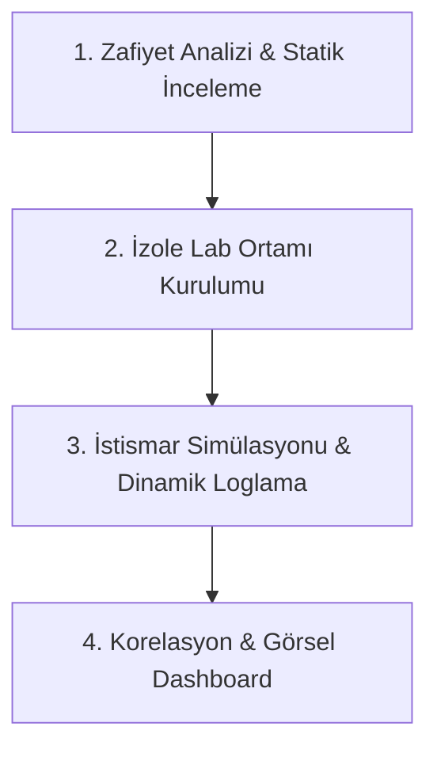
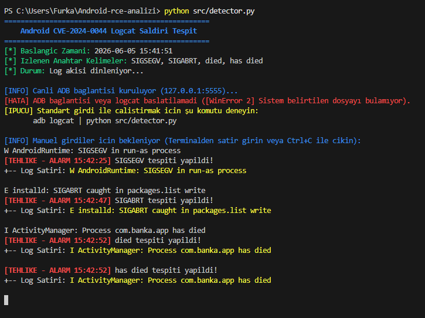

<div align="center">
  <a href="https://istinye.edu.tr">
    
  </a>

  # CVE Araştırma ve PoC Laboratuvarı — Android Güvenlik Analizi

  
  
  
  
  
</div>

---

## 👨‍🏫 Danışman Bilgisi
| Ad Soyad | Keyvan Arasteh |
| :--- | :--- |
| **GitHub** | [@keyvanarasteh](https://github.com/keyvanarasteh) |
| **E-posta** | keyvan.arasteh@istinye.edu.tr |
| **LinkedIn** | [keyvanarasteh](https://linkedin.com/in/keyvanarasteh) |
| **Web Sitesi** | [qline.tech](https://qline.tech) |

## 👤 Öğrenci Bilgisi
| Ad Soyad | Baha Furkan Yıldız |
| :--- | :--- |
| **Öğrenci No** | 2520****1009 |


## 📚 Ders Bilgileri
| Ders Adı | Sızma Testi |
| :--- | :--- |
| **Ders Kodu** | BGT006 |
| **Kredi** | 3 AKTS |
| **Ön Koşullar** | Ağ Temelleri, Linux CLI |
| **Dönem** | 2025-2026 Bahar |

---

## 🚀 Proje Özeti ve Kapsamı
Bu proje, İstinye Üniversitesi Bilgi Güvenliği Teknolojisi programı Sızma Testi (BGT006) dersi final ödevi olarak geliştirilmiştir. Proje kapsamında Android ekosistemini etkileyen 3 farklı güncel zafiyet (CVE-2024-0044, CVE-2024-43093, CVE-2024-23706) derinlemesine incelenmiş, izole lab ortamı kurgulanmış ve siber dedektiflik metodolojisiyle analiz edilmiştir.

### 🎯 Çözdüğü Sorun ve Projenin Amacı
Geleneksel Android güvenlik analizleri genellikle sadece teorik dokümantasyon veya statik görsellerden ibarettir. Bu proje, **saldırı ve savunma döngüsünü çalışan kodlarla birleştirerek** şu temel sorunları çözer:
* **Zafiyetlerin Canlı Analizi:** CVE-2024-0044 gibi kritik yetki yükseltme (LPE) açıklarının Android log katmanındaki (logcat) ayak izlerini canlı yakalar.
* **Red Team & Blue Team Korelasyonu:** Kırmızı takım sömürü aracı (`exploit_sim.py`) ile mavi takım log izleme dedektörünü (`detector.py`) uç uca bağlayarak tam bir saldırı-savunma PoC'si (Proof of Concept) sunar.
* **Ürünleşmiş Güvenlik Çıktıları:** Tespit edilen alarmları SIEM standartlarına uygun olarak anlık JSON/CSV raporlarına dönüştürür ve merkezi gösterim paneline (Dashboard) besler.

### ⚡ Tek Komutla Çalışan PoC (Saldırı-Tespit Simülasyonu)
Projeyi klonlayan bir kullanıcının saniyeler içinde çalışıp çıktıyı görebilmesi için tek komutla çalışan PoC başlatıcılar (`run_poc.bat` / `run_poc.sh`) eklenmiştir. Bu betikler, kırmızı takımın istismar adımlarını simüle eder ve mavi takım dedektörünün alarm üreterek `reports/detection_results.json` dosyasına yazmasını sağlar. Ayrıntılı çalıştırma adımları için [Kurulum ve Çalıştırma](#kurulum-ve-çalıştırma) bölümüne bakabilirsiniz.


### 📊 Analiz Edilen Zafiyetlerin Özet Tablosu

| CVE Kodu | Zafiyet Türü | CVSSv3 Skoru | Etkilenen Bileşen | Saldırı Vektörü |
| :--- | :--- | :--- | :--- | :--- |
| **CVE-2024-0044** | Run-as UID Bypass (LPE & RCE) | **8.8 (High)** | Android System Server | Local (ADB / Kötücül Uygulama) |
| **CVE-2024-43093** | SQLite & DocumentProvider Bypass | **7.8 (High)** | Android SQLite Library | Local (Medya/Dosya Erişimi) |
| **CVE-2024-23706** | Package Manager Bypass | **7.8 (High)** | Android Package Manager | Local (Uygulama Kurulumu) |

### 🔌 Vize Modülü (NetVanguard) Entegrasyonu
Proje kapsamında geliştirilen `src/detector.py` uç nokta log analiz ajanı, vize projesi olarak hayata geçirilen **NetVanguard** merkezi anomali izleme ve alarm paneline entegre edilmiştir. Emülatör üzerinde oluşan kritik zafiyet imzaları ağ üzerinden NetVanguard backend motoruna aktarılarak merkezi izleme (SIEM) mimarisi simüle edilmiştir.

### 🕵️ Log Analiz Ajanı (src/detector.py) Çalışma Mimarisi

Zafiyet tespit ajanı (`src/detector.py`), Android cihaz üzerinde gerçekleştirilen sömürü faaliyetlerini tespit etmek için tasarlanmış hafif (lightweight) bir uç nokta log izleme motorudur.

#### Temel Özellikler ve Çalışma Modları:
1. **Esnek Log Girdisi (3 Farklı Mod):**
   * **Canlı ADB Logcat Akışı:** Emülatöre doğrudan `adb connect` komutuyla bağlanarak cihaz loglarını canlı izler.
   * **Pipeline / Stdin Modu:** `adb logcat | python src/detector.py` mimarisiyle diğer CLI araçlarıyla borulanabilir.
   * **Dosya Takibi (Tail -f):** Önceden kaydedilmiş log dosyalarını (`.log`) dinamik olarak satır satır izler.
   * **Fallback (Manuel Girdi):** Sistemde ADB veya log dosyası kurulu değilse, test amaçlı manuel girilen log satırlarını filtreler (Canlı simülasyon modülü).
2. **Kural Tabanlı İmza Eşleşmesi:**
   * `.env` dosyasındaki `DETECTION_KEYWORDS` değişkeninden beslenir.
   * Android Runtime çökmeleri (`SIGSEGV`), paket yükleme hataları (`SIGABRT`) ve çöken güvenli uygulamalar (`Process has died`) gibi kritik sömürü imzalarını yakaladığında anında terminalde ve loglarda `[TEHLIKE - ALARM]` üretir.

---

## 🛠️ Kullanılan Teknolojiler

| Teknoloji | Kullanım Amacı |
| :--- | :--- |
| **Python 3.x** | Tespit motoru, saldırı simülasyonu |
| **Android SDK / ADB** | Emülatör yönetimi, cihaz iletişimi |
| **Docker** | İzole lab ortamı konteynerizasyonu |
| **Flask** | Web izleme paneli |
| **Logcat** | Android sistem log analizi |

---

## 📂 Proje Dizin Yapısı

```
Android-rce-analizi/
├── .github/
│   └── workflows/
│       └── detector_test.yml  # GitHub Actions (CI/CD) Otomatik Test Yapılandırması
├── .gitattributes             # GitHub dil istatistikleri ve dosya nitelikleri yapılandırması
├── README.md                  # Proje ana belgesi
├── ROADMAP.md                 # Proje yol haritası (Faz 0-5)
├── start_dashboard.bat        # Windows için Web Dashboard başlatıcı
├── start_dashboard.sh         # macOS/Linux için Web Dashboard başlatıcı
├── run_poc.bat                # Windows için tek tıkla çalışan PoC simülatörü
├── run_poc.sh                 # macOS/Linux için tek tıkla çalışan PoC simülatörü
├── .gitignore                 # Git takip dışı dosyalar
├── .env.example               # Ortam değişkenleri şablonu
├── Dockerfile                 # Docker yapılandırması
├── docker-compose.yml         # Çoklu konteyner yapılandırması
├── LICENSE                    # Lisans dosyası
├── mitigation/                # Zafiyet azaltma ve düzeltme (patch) dosyaları
│   ├── cve_2024_0044_patch.diff
│   ├── cve_2024_23706_mitigation.md
│   └── cve_2024_43093_mitigation.md
├── src/                       # Kaynak kodlar
│   ├── detector.py            # Uç nokta log analiz ajanı (Gerçek zamanlı tespit motoru)
│   ├── exploit_sim.py         # Kırmızı Takım (Red Team) zafiyet istismar simülatörü
│   └── test_detector.py       # Ajan için yazılmış otomatik birim (unit) testleri
├── reports/                   # Simüle edilmiş tarama ve tespit raporları
│   ├── nessus_scan.csv        # Simüle edilmiş Nessus zafiyet tarama çıktısı
│   └── detection_results.json # Tespit motorunun anlık olarak kaydettiği log çıktıları
├── web/                       # Web Dashboard arayüzü
│   ├── index.html             # Ana dashboard HTML dosyası
│   ├── css/style.css          # Arayüz stilleri
│   └── js/main.js             # Arayüz dinamikleri ve terminal simülatörü
├── docs/                      # Dokümantasyon
│   ├── assets/                # Görseller ve medya dosyaları (Demo GIF dahil)
│   ├── modules/               # Modül belgeleri
│   ├── references/            # Referans kaynakları
│   └── research/              # Derinlemesine araştırma belgeleri
│       ├── 01_zafiyet_analizi.md
│       ├── 02_teknik_mekanizma.md
│       ├── 03_saldirgan_perspektifi.md
│       ├── cve_2024_23706.md
│       ├── cve_2024_43093.md
│       ├── detector_test_output.md  # Test rapor çıktısı
│       └── final_rapor.md           # Ders teslim final raporu
└── honeypot/                  # Honeypot ortam dosyaları (Emülatör kurulum rehberi)
```


---

## 🔬 Analiz ve Simülasyon Metodolojisi

Proje kapsamında zafiyet analizi ve savunma simülasyonları 4 temel aşamadan oluşan bir siber güvenlik döngüsüyle ele alınmıştır:



1. **Statik ve Teorik Analiz:** AOSP (Android Open Source Project) kaynak kodları incelenerek UID eşleşmeleri, SQLite veritabanı erişim kısıtlamaları ve paket yükleme mekanizmalarındaki mantıksal hatalar belirlenmiştir.
2. **İzole Laboratuvar Ortamı:** Android emülatörü (API 33-34) ve honeypot yapılandırması Docker konteynerleri ile izole edilmiş bir sızma testi ağına alınmıştır.
3. **Dinamik Loglama ve Tespit:** Zafiyetler tetiklendiğinde ortaya çıkan çökme ve bypass izleri (`SIGSEGV` vb.) `src/detector.py` zafiyet tespit ajanı tarafından filtre edilerek yakalanmıştır.
4. **Dashboard Görselleştirme:** Toplanan veriler, yöneticilerin ve analistlerin anlayabileceği risk matrisleri, saldırı zinciri grafikleri ve canlı terminal simülasyonlarıyla zenginleştirilerek `web/` arayüzüne taşınmıştır.

---

## Kurulum ve Çalıştırma

### Ön Koşullar
- Python 3.8+
- Android SDK (API Level 33-34)
- Docker & Docker Compose
- ADB (Android Debug Bridge)

#### 1. Adım: Hazırlık
```bash
# 1. Repoyu klonlayın ve dizine gidin
git clone https://github.com/bfurkanyildiz/Android-rce-analizi.git
cd Android-rce-analizi

# 2. Ortam değişkenlerini hazırlayın (.env olmadan varsayılan ayarlar kullanılır)
cp .env.example .env
```

#### 2. Adım: Çalıştırma Seçenekleri

##### 🚀 Seçenek A: Tek Tıklamayla PoC Simülasyonu (En Hızlı Yöntem)
Herhangi bir kurulum veya emülatör ayarı gerekmeden, saldırı ve tespit mekanizmasını uç uca test etmek için:
* **Windows (Çift Tıklama veya CMD):**
  ```cmd
  run_poc.bat
  ```
* **macOS / Linux (Terminal):**
  ```bash
  bash run_poc.sh
  ```

##### 🕵️ Seçenek B: Manuel Canlı ADB Modu
Android Emülatörünüz açıkken gerçek zamanlı logcat yakalamak için:
```bash
# Ajanı başlatın (ADB üzerinden canlı logları dinlemeye başlar)
python src/detector.py

# Ayrı bir terminalden saldırı simülatörünü tetikleyin
python src/exploit_sim.py
```

##### 🐳 Seçenek C: Docker ile Konteyner Modu
Tüm bağımlılıkları izole bir Docker konteynerinde başlatmak için:
```bash
docker-compose up -d
```

#### 3. Adım: Otomatik Testleri Çalıştırma
Yazılım kalitesi ve CI/CD standartlarını test etmek için:
```bash
python -m unittest src/test_detector.py
```

---

## 🖥️ Web Dashboard Arayüzü

Projeyi klonlayan (git clone) herhangi bir kullanıcı, analiz raporlarını ve terminal simülasyonunu içeren zengin web arayüzünü kendi yerelinde kolayca çalıştırabilir.

### Dashboard Önizleme (Demo)
<video src="docs/assets/live-demo.mp4" width="100%" controls></video>

Arayüzü görüntülemek için aşağıdaki yöntemlerden birini kullanabilirsiniz:

### 1. Otomatik Başlatıcı Scriptler (Önerilen)
Yerel HTTP sunucusunu arka planda başlatıp arayüzü varsayılan tarayıcınızda otomatik olarak açmak için işletim sisteminize uygun komutu çalıştırın:

* **Windows (PowerShell / CMD):** Proje ana dizinindeki `start_dashboard.bat` dosyasına çift tıklayabilir veya terminalden şu komutla çalıştırabilirsiniz:
  ```cmd
  start_dashboard.bat
  ```
* **macOS / Linux (Bash):** Terminalden doğrudan başlatmak için (çalıştırma izni gerektirmeden):
  ```bash
  bash start_dashboard.sh
  ```
  veya dosyaya çalıştırma yetkisi vererek:
  ```bash
  chmod +x start_dashboard.sh
  ./start_dashboard.sh
  ```

### 2. Çevrimdışı (Sunucusuz) Çalıştırma
Herhangi bir yerel sunucu kurmadan doğrudan çalıştırmak için:
1. `web/` dizinine gidin.
2. `index.html` dosyasına çift tıklayarak tarayıcınızda doğrudan açın.

### 3. Manuel Sunucu ile Başlatma
Python sunucusunu elle başlatmak isterseniz:
```bash
python -m http.server 8080
```
Ardından tarayıcınızdan `http://localhost:8080/web/index.html` adresine gidin.

### 🔄 CI/CD ve Otomatik Güvenlik/Kalite Taramaları

Projemiz siber güvenlik standartlarına uygun yazılım mühendisliği (DevSecOps) prensipleriyle yönetilmektedir. Repoya yapılan her push veya pull request işleminde GitHub Actions şu iş akışını (pipeline) çalıştırır:
1. **Çoklu İşletim Sistemi Desteği (Matrix Build):** Ajanın kodları hem `ubuntu-latest` hem de `windows-latest` sistemlerinde test edilerek platformlar arası uyumluluk doğrulanır.
2. **Statik Kod Analizi (Linter):** `flake8` aracı ile Python yazım standartları (PEP 8) denetlenir.
3. **Statik Güvenlik Analizi (Bandit Scan):** `bandit` aracı ile kodda oluşabilecek kritik zafiyet kalıpları otomatik taranır (tüm false-positive durumlar siber güvenlik standartlarında `# nosec` ile işaretlenmiştir).
4. **Boru Hattı Entegrasyon Testi:** `exploit_sim.py | detector.py` borusu çalıştırılarak uçtan uca sömürü-tespit döngüsü simüle edilir.
5. **Rapor Çıktısı (Artifacts):** Başarılı çalışan PoC sonucunda üretilen `detection_results.json` otomatik zip dosyası olarak Actions çıktılarına yüklenir.

#### PoC Terminal Çıktısı Önizleme:



---

## ⚠️ Yasal Uyarı

Bu proje **yalnızca akademik ve eğitim amaçlıdır**. Tüm testler kontrollü laboratuvar ortamında, izole edilmiş sanal makineler üzerinde gerçekleştirilmektedir. Gerçek cihazlara veya üçüncü taraf sistemlere yönelik herhangi bir saldırı girişimi **yasa dışıdır** ve bu projenin kapsamı dışındadır.

---

## 📄 Lisans

Bu proje [GNU General Public License v3.0](LICENSE) ile lisanslanmıştır.