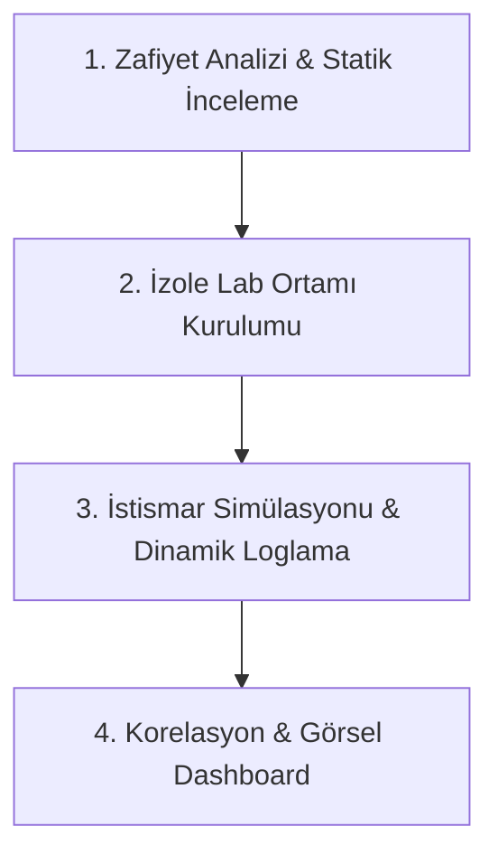
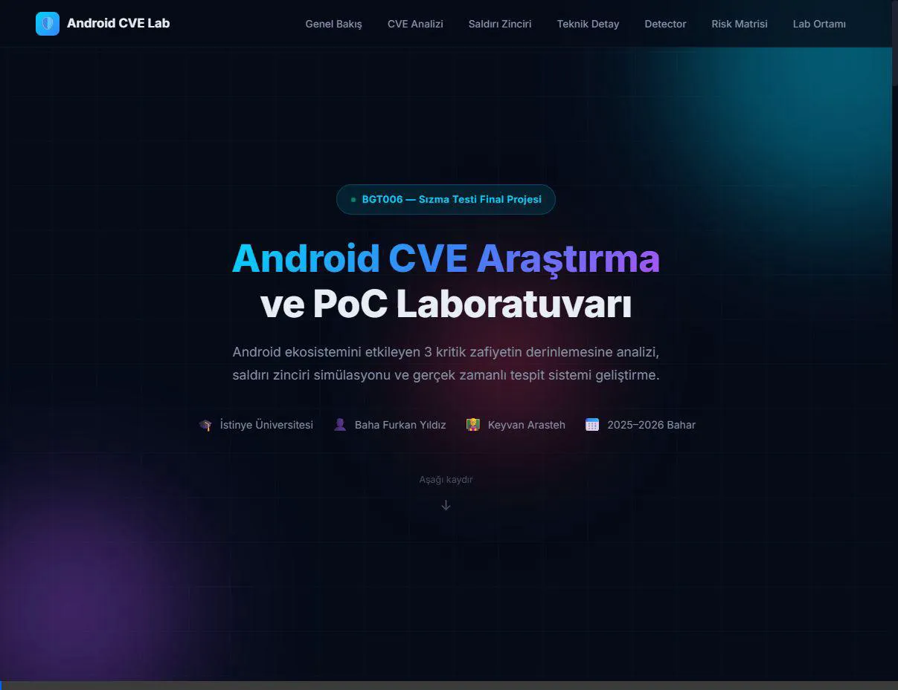

<div align="center">
  <a href="https://istinye.edu.tr">
    
  </a>

  # CVE Araştırma ve PoC Laboratuvarı — Android Güvenlik Analizi

  
  
  
  
  
</div>

---

## 👨‍🏫 Danışman Bilgisi
| Ad Soyad | Keyvan Arasteh |
| :--- | :--- |
| **GitHub** | [@keyvanarasteh](https://github.com/keyvanarasteh) |
| **E-posta** | keyvan.arasteh@istinye.edu.tr |
| **LinkedIn** | [keyvanarasteh](https://linkedin.com/in/keyvanarasteh) |
| **Web Sitesi** | [qline.tech](https://qline.tech) |

## 👤 Öğrenci Bilgisi
| Ad Soyad | Baha Furkan Yıldız |
| :--- | :--- |
| **Öğrenci No** | 2520****1009 |


## 📚 Ders Bilgileri
| Ders Adı | Sızma Testi |
| :--- | :--- |
| **Ders Kodu** | BGT006 |
| **Kredi** | 3 AKTS |
| **Ön Koşullar** | Ağ Temelleri, Linux CLI |
| **Dönem** | 2025-2026 Bahar |

---

## 🚀 Proje Özeti ve Kapsamı
Bu proje, İstinye Üniversitesi Bilgi Güvenliği Teknolojisi programı Sızma Testi (BGT006) dersi final ödevi olarak geliştirilmiştir. Proje kapsamında Android ekosistemini etkileyen 3 farklı güncel zafiyet (CVE-2024-0044, CVE-2024-43093, CVE-2024-23706) derinlemesine incelenmiş, izole lab ortamı kurgulanmış ve siber dedektiflik metodolojisiyle analiz edilmiştir.

### 📊 Analiz Edilen Zafiyetlerin Özet Tablosu

| CVE Kodu | Zafiyet Türü | CVSSv3 Skoru | Etkilenen Bileşen | Saldırı Vektörü |
| :--- | :--- | :--- | :--- | :--- |
| **CVE-2024-0044** | Run-as UID Bypass (LPE & RCE) | **8.8 (High)** | Android System Server | Local (ADB / Kötücül Uygulama) |
| **CVE-2024-43093** | SQLite & DocumentProvider Bypass | **7.8 (High)** | Android SQLite Library | Local (Medya/Dosya Erişimi) |
| **CVE-2024-23706** | Package Manager Bypass | **7.8 (High)** | Android Package Manager | Local (Uygulama Kurulumu) |

### 🔌 Vize Modülü (NetVanguard) Entegrasyonu
Proje kapsamında geliştirilen `src/detector.py` uç nokta log analiz ajanı, vize projesi olarak hayata geçirilen **NetVanguard** merkezi anomali izleme ve alarm paneline entegre edilmiştir. Emülatör üzerinde oluşan kritik zafiyet imzaları ağ üzerinden NetVanguard backend motoruna aktarılarak merkezi izleme (SIEM) mimarisi simüle edilmiştir.

### 🕵️ Log Analiz Ajanı (src/detector.py) Çalışma Mimarisi

Zafiyet tespit ajanı (`src/detector.py`), Android cihaz üzerinde gerçekleştirilen sömürü faaliyetlerini tespit etmek için tasarlanmış hafif (lightweight) bir uç nokta log izleme motorudur.

#### Temel Özellikler ve Çalışma Modları:
1. **Esnek Log Girdisi (3 Farklı Mod):**
   * **Canlı ADB Logcat Akışı:** Emülatöre doğrudan `adb connect` komutuyla bağlanarak cihaz loglarını canlı izler.
   * **Pipeline / Stdin Modu:** `adb logcat | python src/detector.py` mimarisiyle diğer CLI araçlarıyla borulanabilir.
   * **Dosya Takibi (Tail -f):** Önceden kaydedilmiş log dosyalarını (`.log`) dinamik olarak satır satır izler.
   * **Fallback (Manuel Girdi):** Sistemde ADB veya log dosyası kurulu değilse, test amaçlı manuel girilen log satırlarını filtreler (Canlı simülasyon modülü).
2. **Kural Tabanlı İmza Eşleşmesi:**
   * `.env` dosyasındaki `DETECTION_KEYWORDS` değişkeninden beslenir.
   * Android Runtime çökmeleri (`SIGSEGV`), paket yükleme hataları (`SIGABRT`) ve çöken güvenli uygulamalar (`Process has died`) gibi kritik sömürü imzalarını yakaladığında anında terminalde ve loglarda `[TEHLIKE - ALARM]` üretir.

---

## 🛠️ Kullanılan Teknolojiler

| Teknoloji | Kullanım Amacı |
| :--- | :--- |
| **Python 3.x** | Tespit motoru, saldırı simülasyonu |
| **Android SDK / ADB** | Emülatör yönetimi, cihaz iletişimi |
| **Docker** | İzole lab ortamı konteynerizasyonu |
| **Flask** | Web izleme paneli |
| **Logcat** | Android sistem log analizi |

---

## 📂 Proje Dizin Yapısı

```
Android-rce-analizi/
├── README.md                  # Proje ana belgesi
├── ROADMAP.md                 # Proje yol haritası (Faz 0-5)
├── start_dashboard.bat        # Windows için Web Dashboard baslatici
├── start_dashboard.sh         # macOS/Linux için Web Dashboard baslatici
├── .gitignore                 # Git takip dışı dosyalar
├── .env.example               # Ortam değişkenleri şablonu
├── Dockerfile                 # Docker yapılandırması
├── docker-compose.yml         # Çoklu konteyner yapılandırması
├── LICENSE                    # Lisans dosyası
├── src/                       # Kaynak kodlar
│   └── detector.py            # Uç nokta log analiz ajanı
├── web/                       # Web Dashboard arayuzu
│   ├── index.html             # Ana dashboard HTML dosyasi
│   ├── css/style.css          # Arayuz stilleri
│   └── js/main.js             # Arayuz dinamikleri ve terminal simulatoru
├── docs/                      # Dokümantasyon
│   ├── assets/                # Görseller ve medya dosyaları
│   ├── modules/               # Modül belgeleri
│   ├── references/            # Referans kaynakları
│   └── research/              # Araştırma belgeleri
├── honeypot/                  # Honeypot ortam dosyaları
└── archive/                   # Arşivlenmiş / kullanım dışı dosyalar
```

---

## 🔬 Analiz ve Simülasyon Metodolojisi

Proje kapsamında zafiyet analizi ve savunma simülasyonları 4 temel aşamadan oluşan bir siber güvenlik döngüsüyle ele alınmıştır:



1. **Statik ve Teorik Analiz:** AOSP (Android Open Source Project) kaynak kodları incelenerek UID eşleşmeleri, SQLite veritabanı erişim kısıtlamaları ve paket yükleme mekanizmalarındaki mantıksal hatalar belirlenmiştir.
2. **İzole Laboratuvar Ortamı:** Android emülatörü (API 33-34) ve honeypot yapılandırması Docker konteynerleri ile izole edilmiş bir sızma testi ağına alınmıştır.
3. **Dinamik Loglama ve Tespit:** Zafiyetler tetiklendiğinde ortaya çıkan çökme ve bypass izleri (`SIGSEGV` vb.) `src/detector.py` zafiyet tespit ajanı tarafından filtre edilerek yakalanmıştır.
4. **Dashboard Görselleştirme:** Toplanan veriler, yöneticilerin ve analistlerin anlayabileceği risk matrisleri, saldırı zinciri grafikleri ve canlı terminal simülasyonlarıyla zenginleştirilerek `web/` arayüzüne taşınmıştır.

---

## ⚙️ Kurulum ve Çalıştırma

### Ön Koşullar
- Python 3.8+
- Android SDK (API Level 33-34)
- Docker & Docker Compose
- ADB (Android Debug Bridge)

### Kurulum
```bash
# 1. Repoyu klonlayın
git clone https://github.com/bfurkanyildiz/Android-rce-analizi.git
cd Android-rce-analizi

# 2. Ortam değişkenlerini ayarlayın
cp .env.example .env

# 3. Docker ortamını başlatın
docker-compose up -d

# 4. Python bağımlılıklarını yükleyin (varsa)
pip install -r requirements.txt
```

---

## 🖥️ Web Dashboard Arayüzü

Projeyi klonlayan (git clone) herhangi bir kullanıcı, analiz raporlarını ve terminal simülasyonunu içeren zengin web arayüzünü kendi yerelinde kolayca çalıştırabilir.

### Dashboard Önizleme (Demo)


Arayüzü görüntülemek için aşağıdaki yöntemlerden birini kullanabilirsiniz:

### 1. Otomatik Başlatıcı Scriptler (Önerilen)
Yerel HTTP sunucusunu arka planda başlatıp arayüzü varsayılan tarayıcınızda otomatik olarak açmak için işletim sisteminize uygun komutu çalıştırın:

* **Windows (PowerShell / CMD):** Proje ana dizinindeki `start_dashboard.bat` dosyasına çift tıklayabilir veya terminalden şu komutla çalıştırabilirsiniz:
  ```cmd
  start_dashboard.bat
  ```
* **macOS / Linux (Bash):** Terminalden doğrudan başlatmak için (çalıştırma izni gerektirmeden):
  ```bash
  bash start_dashboard.sh
  ```
  veya dosyaya çalıştırma yetkisi vererek:
  ```bash
  chmod +x start_dashboard.sh
  ./start_dashboard.sh
  ```

### 2. Çevrimdışı (Sunucusuz) Çalıştırma
Herhangi bir yerel sunucu kurmadan doğrudan çalıştırmak için:
1. `web/` dizinine gidin.
2. `index.html` dosyasına çift tıklayarak tarayıcınızda doğrudan açın.

### 3. Manuel Sunucu ile Başlatma
Python sunucusunu elle başlatmak isterseniz:
```bash
python -m http.server 8080
```
Ardından tarayıcınızdan `http://localhost:8080/web/index.html` adresine gidin.

### 🔄 CI/CD Otomatik Test Süreci

Proje, yazılım kalitesi ve sürekli entegrasyon (CI/CD) standartlarına uygun olarak tasarlanmıştır. GitHub Actions entegrasyonu sayesinde repoya yapılan her push ve pull request işleminde:
* Kod tabanı otomatik olarak taranır ve sanal ortam kurulur.
* `src/test_detector.py` birimi çalıştırılarak `detector.py` alarm korelasyon motorunun doğruluğu test edilir.


---

## ⚠️ Yasal Uyarı

Bu proje **yalnızca akademik ve eğitim amaçlıdır**. Tüm testler kontrollü laboratuvar ortamında, izole edilmiş sanal makineler üzerinde gerçekleştirilmektedir. Gerçek cihazlara veya üçüncü taraf sistemlere yönelik herhangi bir saldırı girişimi **yasa dışıdır** ve bu projenin kapsamı dışındadır.

---

## 📄 Lisans

Bu proje [GNU General Public License v3.0](LICENSE) ile lisanslanmıştır.