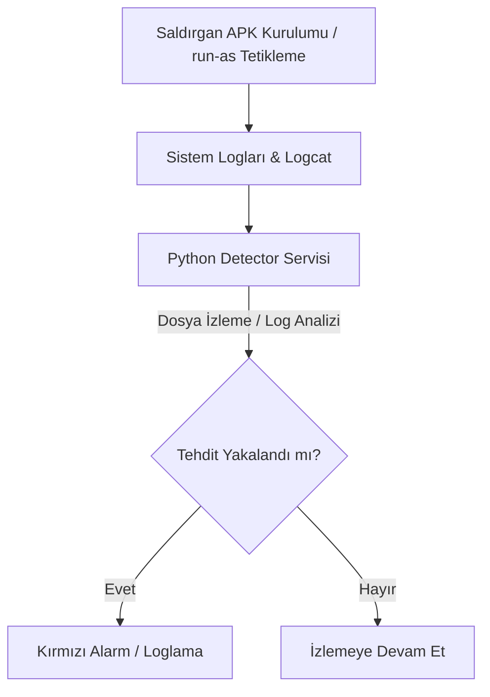

# CVE-2024-0044 — Android `run-as` Ayrıcalık Yükseltme Modülü

> **Zafiyet:** CVE-2024-0044 (Android run-as Privilege Escalation)  
> **Modül Tipi:** Tespit ve İzleme (Detection & Monitoring)  
> **Etki:** Yerel Ayrıcalık Yükseltme (Local Privilege Escalation - LPE)  
> **CVSSv3 Skoru:** 7.8 (Yüksek)

---

## 1. Modül Amacı ve Kapsamı

Bu modül, Android `run-as` komutundaki girdi doğrulama açığından faydalanan **CVE-2024-0044** zafiyetini incelemek, zafiyetin honeypot üzerinde simüle edilmesi durumunda tetiklenen çökme ve anormal durum sinyallerini tespit etmek ve ilgili tehditleri raporlamak amacıyla tasarlanmıştır.

Modülün ana işlevleri şunlardır:
* Zafiyet sömürü denemeleri sırasında oluşan sistem anomalilerini log seviyesinde takip etmek.
* `run-as` aracının anormal çağrılarını izlemek.
* Süreç sonlanmaları (`died`), geçersiz bellek erişimleri (`SIGSEGV`) ve iptal sinyalleri (`SIGABRT`) üzerinden sömürü belirtilerini yakalamak.

---

## 2. Zafiyetin Detaylı Analizi

### 2.1 Paket Listesi Manipülasyonu (Newline Injection)

Android'de `run-as` komutu, hedef uygulamanın `debuggable` (hata ayıklanabilir) olup olmadığını `/data/system/packages.list` dosyasından kontrol eder. Bu dosya, `\n` (satır sonu) karakterleriyle ayrılmış alanlardan oluşur.

Zafiyet, `PackageInstallerService` bileşeninin `pm install -i` veya session API üzerinden yeni paket yüklerken **installer package name** parametresini yeterince sanitize etmemesinden kaynaklanır.

1. **Saldırgan Girdisi:** Saldırgan, adında `\n` barındıran sahte bir paket kurucu adı belirler:
   `com.saldirgan.app\ncom.hedef.app 10203 1 /data/data/com.hedef.app ...`
2. **Kayıt Bozma:** Sistem bu paketi kaydettiğinde, `/data/system/packages.list` dosyasına doğrudan yazar ve aradaki `\n` karakteri nedeniyle dosyada yeni bir satır oluşur.
3. **Öncelik Kazanma:** `run-as` dosyayı yukarıdan aşağıya tarar. Saldırganın eklediği sahte satır, hedef uygulamanın gerçek satırından daha yukarıda yer aldığı için `run-as` bu sahte satırdaki `debuggable=1` değerini referans alır ve hedef uygulamanın UID'si ile shell açılmasını sağlar (`setuid`).

> [!WARNING]
> Zafiyetin sömürülmesi için herhangi bir kullanıcı etkileşimi gerekmez. Cihaza ADB erişimi olan bir saldırgan veya cihazda çalışan sıradan bir uygulama bu işlemi gerçekleştirebilir.

---

## 3. Modülün Honeypot Entegrasyonu

Honeypot ortamında bu zafiyetin takibi iki ana aşamadan oluşur:

### 3.1 Yakalanacak Kritik İmzalar

Saldırı simülasyonu sırasında veya `run-as` ile hedef uygulamanın UID'si taklit edilerek yapılan işlemler sırasında sistemde bazı çökmeler veya anormal servis sonlanmaları gerçekleşebilir. Bu modülün tespit motoru (`src/detector.py`), `logcat` çıktısı üzerinde aşağıdaki kritik imzaları arar:

* **`SIGSEGV` (Segmentation Fault):** Belleğe yetkisiz erişim denemeleri veya istismar kodunun çökmesi durumunda loglara yansır.
* **`SIGABRT` (Abort):** Uygulamanın veya servislerin olağandışı bir hata nedeniyle kendini sonlandırması.
* **`died` / `has died`:** İzlenen kritik servislerin veya `run-as` tarafından çağrılan alt süreçlerin beklenmedik şekilde sonlanması.

---

## 4. Korunma Yöntemleri

> [!TIP]
> Cihazı bu zafiyete karşı korumak için en etkili yöntem Android Security Bulletin **Ekim 2024** (veya en az Mart 2024) güvenlik yamalarını içeren bir sistem imajı kullanmaktır. Ek olarak, kurumsal cihazlarda `ADB` erişiminin kapatılması saldırı yüzeyini önemli ölçüde azaltır.
