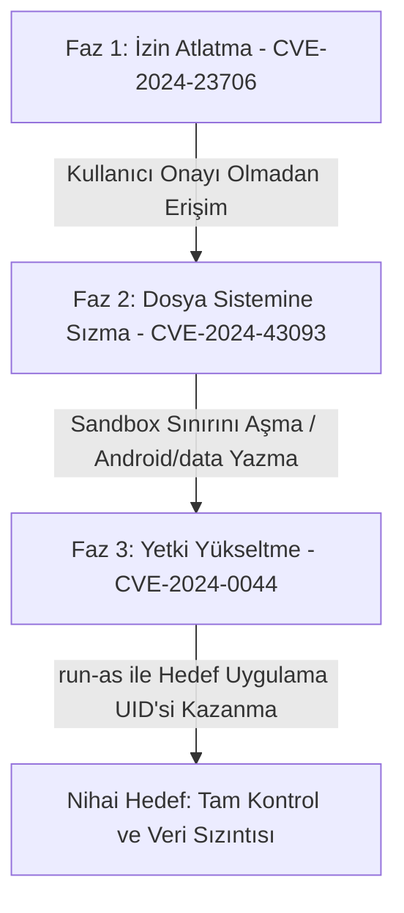

# Android Ekosisteminde Çoklu Zafiyet Zinciri ve Saldırgan Perspektifi

> **Konu:** CVE-2024-23706, CVE-2024-43093 ve CVE-2024-0044 Zafiyetlerinin Mantıksal Kombinasyonu  
> **Kapsam:** Saldırı Zinciri (Attack Chain) ve Siber Güvenlik Metodolojisi  
> **Hedef Kitle:** Temel düzeyde siber güvenlik ve Android mimarisi bilgisine sahip öğrenciler  

---

## 1. Android Ekosisteminde Saldırı Zinciri (Attack Chain) Kavramı

Modern Android işletim sistemi, çok katmanlı güvenlik korumaları (sandbox, SELinux, İzin İzin Denetleyicileri) ile donatılmıştır. Bu nedenle, günümüzde saldırganlar hedef sistem üzerinde tam kontrol elde etmek için tek bir açık yerine **Saldırı Zinciri (Attack Chain)** metodolojisini kullanırlar. 

Saldırganlar;
* Önce sisteme sızmak veya tespit edilmeden yetki almak için bir **izin atlatma** açığını,
* Ardından sistem dosyalarında değişiklik yapmak için bir **sandbox bypass** açığını,
* Son olarak da hedef sürecin kimliğine bürünmek için bir **yetki yükseltme** (Privilege Escalation) açığını bir araya getirir.

Böylece her bir zafiyet, bir sonraki aşamanın anahtarı haline gelir.

---

## 2. İncelediğimiz Zafiyetlerin Mantıksal Kombinasyonu (Senaryo)

Saldırganın bu 3 zafiyeti birleştirerek cihazı ele geçirme senaryosu teorik olarak şu şekilde gerçekleşir:

1. **Giriş ve İzin Manipülasyonu (CVE-2024-23706):** Saldırgan, cihaza kurduğu zararlı yazılım üzerinden kullanıcıya hiçbir onay penceresi göstermeden sistemin izin denetleyicisini atlatır. Cihazda sessizce bir altyapı oluşturur.
2. **Sandbox Bypass ve Dosya Yazma (CVE-2024-43093):** İzin denetimini aşan uygulama, Storage Access Framework (SAF) üzerindeki Unicode normalizasyon açığını kullanarak `Android/data` dizinindeki diğer uygulamaların korumalı klasörlerine erişim hakkı kazanır.
3. **Yetki Yükseltme (CVE-2024-0044):** Dosya sistemine yazma hakkı kazanan saldırgan, `pm install` parametresi ile enjekte ettiği sahte satır sonu karakterini (`\n`) sisteme yazdırarak `/data/system/packages.list` dosyasını zehirler. Son olarak `run-as com.hedef.app` komutunu çalıştırarak hedef uygulamanın UID'siyle (örneğin bir bankacılık veya mesajlaşma uygulamasının yetkileriyle) sistemde tam kontrol sağlar.

---

## 3. Siber Dedektiflik: Saldırı İzlerinin Tespiti (IoC)

Bir sistem analistinin bu tarz zincirleme sızma girişimlerini tespit etmek için izlemesi gereken **Anormallik Göstergeleri (IoC - Indicators of Compromise)** şunlardır:

* **Sıradışı `packages.list` Değişiklikleri:** Dosyadaki satır sayısının aniden artması, mükerrer paket isimlerinin oluşması veya satır sonlarında beklenmedik `\n` karakterlerinin tespiti.
* **Şüpheli Unicode Dosya Yolları:** SAF (`DocumentsUI`) üzerinden gelen ve standart normalizasyon formlarına uymayan (örneğin fullwidth karakter içeren) URI isteklerinin loglara yansıması.
* **İzin Talebi Olmayan API Çağrıları:** `AndroidRuntime` loglarında, izin bildirim ekranı tetiklenmeden `HealthFitness` veya benzer hassas sistem servislerine veri akışı başlatan şüpheli çağrılar.
* **Çökmeler ve Sinyaller (SIGSEGV / SIGABRT):** `detector.py` aracımızın da izlediği gibi, `run-as` veya `installd` servislerinin istismar denemeleri esnasında oluşturduğu beklenmedik çökme ve sonlanma logları.
